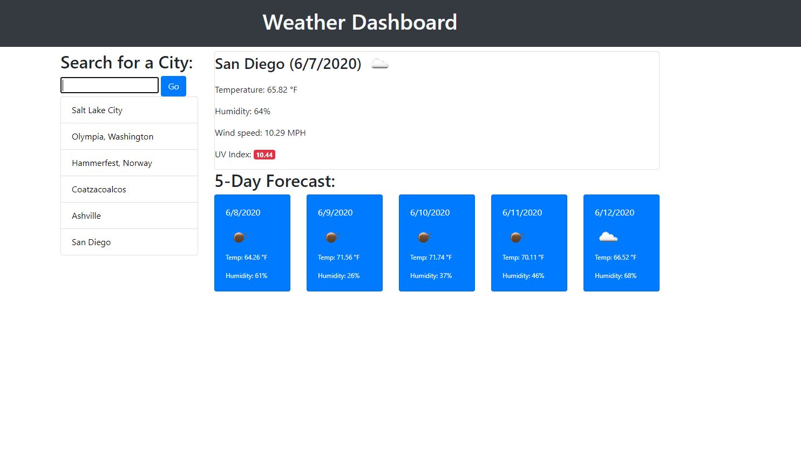

# weather-dashboard

## Purpose

    A website that displays weather data for the day and for the upcoming five days. The website is divided into two primary columns. The left column displays the form for the city name. Later a clickable list of recent searches will be added dynamically under the form. The second column displays the weather data. This column is divided into two sections. The above section displays the data for today's date. This includes the city name, date, icon, temperature, humidity, wind speed, and UV index. 

    This data was obtained through two different api requests. The second request retrieved data only for the UV index. The date information was originally given in UNIX format, so moment was implemented to convert it to a readable date. The temperature was originally in Kelvin so the API query parameters were changed to display in fahrenheit. The UV data required latitude and longitude to fetch the proper data. These are given in the first API request and were passed into the second. An if/else statement was used to style the displayed UV index data according to UV index severity. 

    The below section displays data for the five day forecast. This div contains dynamically added elements that contain the date, weather icon, temperature and humidity for that day. The third api request contains all of this data. 

## Built With
-HTML
-CSS
-Javascript
-JQUERY
-Bootsrap
-moment
-Open Weather Map API
 
## Website
https://parkerrobison.github.io/weather-dashboard/
 
## Preview of the application

 
## Contribution
Made by Parker Robison